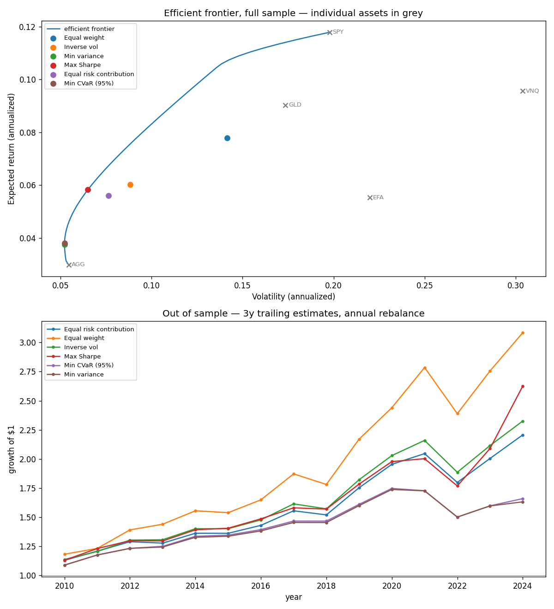

# Portfolio Optimization

**[Live site &rarr;](https://mihircoding.github.io/portfolioOptimization/)** — the efficient frontier, the risk-contribution gap and the walk-forward result, charted from this repo's own output.

Markowitz mean-variance optimization, the efficient frontier, covariance shrinkage, risk
parity, CVaR (tail-risk) optimization and a statistical factor risk model — implemented, then
tested the only way that matters: out of sample.

In sample, the max-Sharpe portfolio wins with a Sharpe of 0.90. It has to; it's defined as the
in-sample argmax. Walk it forward on a trailing estimation window and it finishes **fourth of
six**, behind equal weighting — which requires no estimation, no optimizer, and almost no turnover.
That result holds at every estimation window tested. [RESULTS.md](RESULTS.md) has the numbers;
[INTERVIEW.md](INTERVIEW.md) has how to talk about them.

Five ETFs is a forgiving problem, so `factor_study.py` re-runs the risk machinery on 50 US large
caps, where a covariance matrix has 1,275 parameters and a year of data to fit them with. There
the sample covariance promises 9.2% risk and delivers 15.5%. Section 9 of RESULTS.md is what does
and does not fix that — and the answer turns out to be a constraint rather than an estimator.

The 50-stock optimizer also trades far more: unconstrained min-variance replaces 96% of the book
every quarter, which at 10 bps a side costs 0.82% of return a year. Section 10 charges every
portfolio for its trades and tries a no-trade band against it.

94 tests.

```bash
pip install -r requirements.txt
python -m pytest -q            # 94 passed
python run_optimization.py     # full analysis, writes frontier.png
python factor_study.py         # the 50-asset risk-model study (section 9)
```



---

## How it works

### The Markowitz problem

Given `n` assets with expected returns `μ` and covariance matrix `Σ`, a portfolio with weights
`w` (summing to 1) has:

```
expected return  =  wᵀμ
variance         =  wᵀΣw
volatility       =  √(wᵀΣw)
```

The second line is the whole idea. Portfolio volatility is **not** the weighted average of the
individual volatilities — it's lower whenever assets are less than perfectly correlated, and the
gap is exactly diversification. Markowitz's contribution was making that quantitative: an asset
is not risky or safe on its own, only in the context of what it's held alongside. A volatile
asset that zigs when the rest of your book zags *reduces* portfolio risk.

Three portfolios fall out of it:

- **Minimum variance** — minimize `wᵀΣw` subject to `Σw = 1`. Note what's missing: **no μ**.
  This portfolio needs no return forecasts at all.
- **Maximum Sharpe (tangency)** — maximize `(wᵀμ − rf) / √(wᵀΣw)`. The best risk-adjusted
  portfolio available, and the one every textbook builds to.
- **Efficient frontier** — for each target return, the minimum-variance portfolio achieving it.
  The set of portfolios you can't improve on. Everything below the curve is dominated.

All three are the same `scipy.optimize.minimize` call with SLSQP, different objectives, and a
budget constraint. Long-only is a box constraint on the weights.

### Why the textbook answer fails

Mean-variance optimization treats `μ` and `Σ` as **known constants**. They aren't — they're
noisy estimates from a finite sample. And the optimizer's response to noise is pathological: it
systematically loads into whatever asset had the best estimation luck, because from inside the
objective, a spuriously high mean or spuriously low variance is indistinguishable from a real
edge. Michaud's name for it is the **"error-maximizing" property**, and it's earned.

The asymmetry that makes this bite: **expected returns are much harder to estimate than
covariances.** You need decades of data to pin down a mean return to any useful precision,
while a covariance converges in months. So the input the optimizer is most sensitive to is the
one you know least about.

This project's numbers make the point concretely rather than rhetorically:

| | In-sample Sharpe | Out-of-sample Sharpe | Turnover |
|---|---|---|---|
| Max Sharpe | **0.90** (1st) | 0.75 (4th) | 16.2% |
| Equal weight | 0.55 (5th) | **0.82** (1st) | 0.0% |

### The three standard responses

**1. Covariance shrinkage.** Pull the sample covariance toward a structured target:

```
Σ_shrunk = (1 − α)·Σ_sample + α·diag(Σ_sample)
```

A sample covariance over `N` assets estimates `N(N+1)/2` parameters — 1,275 for 50 assets — from
data that rarely supports it. The *extreme eigenvalues* are the worst-estimated, and those are
exactly the directions an optimizer loads into. Shrinkage adds bias and removes much more
variance; it's a straight bias-variance trade. Ledoit-Wolf derive the optimal α in closed form.

Measured here: α = 0.3 cuts the condition number of Σ from 54.9 to 44.7 and moves the
min-variance weights by 0.07 in L1.

**2. Drop the unreliable input.** Min-variance never sees μ. That's not a limitation, it's the
selling point — the optimizer can't be wrecked by an input it never receives.

**3. Risk-based weighting.** Skip forecasting entirely and allocate by risk.

**4. Get μ from somewhere other than a sample mean.** Black-Litterman runs mean-variance
backwards. If you assume the market portfolio — what everyone actually holds, in the
proportions they hold it — is optimal for someone, exactly one vector of expected returns would
have produced it:

```
Π = δ · Σ · w_market
```

That's not a forecast; it's the market's positioning restated in return space, and it contains
no sample mean at all. You then blend in your own views with an explicit confidence on each,
and the posterior is a precision-weighted average of the two. The useful part is that a view
about one asset propagates: say gold does well, and if Σ knows gold moves with bonds, the
posterior raises bonds too, without anyone writing a view about bonds. Plain max-Sharpe has no
such mechanism — it only knows what you typed into μ.

On this universe the equilibrium and the sample mean disagree by multiples:

| | Equilibrium Π | 18y sample mean |
|---|---|---|
| SPY | 7.78% | 11.79% |
| EFA | 8.03% | 5.53% |
| AGG | 0.13% | 2.99% |
| GLD | 1.44% | 9.03% |
| VNQ | 9.69% | 9.57% |

Equilibrium says gold and bonds should return little because they carry little of the market's
risk. The sample says whatever the last eighteen years happened to deliver. RESULTS.md section
8 asks whether starting from the first column actually helps out of sample, and gives an answer
less flattering than the walk-forward table alone would suggest.

### Risk contributions and ERC

Asset `i`'s share of total portfolio variance:

```
rc_i = w_i · (Σw)_i / (wᵀΣw)
```

This decomposition is **exact**, not approximate — portfolio variance is homogeneous of degree 2
in `w`, so Euler's theorem makes the parts sum to the whole with nothing left over.

It's the number that reveals a portfolio isn't diversified in the way its weights suggest. From
the run:

| Portfolio | SPY | EFA | AGG | GLD | VNQ |
|---|---|---|---|---|---|
| Equal weight (20% capital each) | 25% | 28% | **1%** | 9% | **37%** |
| Equal risk contribution | 20% | 20% | 20% | 20% | 20% |

Equal weight puts a fifth of the *capital* in bonds and gets 1% of its *risk* from them. It
looks balanced and isn't. **Equal risk contribution** solves for the weights where every asset
contributes equally — no closed form except when all correlations are equal (where it reduces to
inverse-vol), so it's solved numerically, started from inverse-vol weights because the objective
isn't convex.

ERC also needs no expected returns. Same robustness argument as min-variance, taken further.

### CVaR: optimizing the tail directly

Every portfolio above minimizes or is scored by **variance** — `wᵀΣw` — which penalizes a
surprise gain exactly as much as a surprise loss of the same size. **CVaR** (Conditional
Value-at-Risk, a.k.a. Expected Shortfall) only looks at the downside: it's the average loss in
the worst `(1 - alpha)` fraction of scenarios, e.g. the average of the worst 5% of days at
`alpha = 0.95`.

The naive definition — sort scenario returns, average the worst tail — can't be optimized
directly: sorting isn't differentiable, and which scenarios ARE the worst tail changes
discontinuously as the weights move. Rockafellar & Uryasev (2000) show minimizing CVaR is
exactly equivalent to a **linear program** in an expanded variable space:

```
minimize_{w, ζ, u}   ζ + 1/((1-α)T) · Σ u_t
subject to            u_t ≥ -(w · r_t) - ζ    for every historical scenario t
                      u_t ≥ 0
                      Σw = 1
```

`ζ` and `u` have no meaning on their own until solved — at the optimum, `ζ` lands exactly on the
portfolio's **Value-at-Risk**, and each `u_t` is the slack absorbing how far scenario `t`'s loss
exceeds it (zero outside the tail). `src/cvar.py :: min_cvar_weights` solves this with
`scipy.optimize.linprog`.

The part worth noticing: this is the only optimizer in this project that works from the actual
historical **scenarios** (`T` daily return vectors) instead of reducing them to `(μ, Σ)` first.
That means two assets with identical mean and variance but different tail shape — one calm and
Gaussian, one calm-but-occasionally-crashes — are indistinguishable to every other method here,
and not to this one. `tests/test_cvar.py` proves that directly on synthetic data built exactly
that way. On this project's own 5-ETF universe, though, it converges to nearly the same portfolio
as min-variance — see RESULTS.md section 7 for why that's a finding about this dataset, not
evidence the method doesn't work.

---

## Layout

```
├── run_optimization.py    # driver: in-sample, risk contributions, shrinkage,
│                          #   walk-forward, Black-Litterman, sensitivities
├── factor_study.py        # driver: the 50-asset risk-model study
├── src/
│   ├── returns.py         # returns, annualized mu and Sigma
│   ├── optimizer.py       # performance, min-variance, max-Sharpe
│   ├── frontier.py        # efficient frontier sweep
│   ├── risk_parity.py     # shrinkage, inverse-vol, risk contributions, ERC
│   ├── cvar.py            # CVaR/VaR, the Rockafellar-Uryasev LP
│   ├── factor_model.py    # Sigma = B Omega B' + D, Marchenko-Pastur factor count
│   ├── black_litterman.py # equilibrium returns, view blending
│   └── costs.py           # drift, linear trading costs, the no-trade band
└── tests/                 # 94 tests
```

## What the tests check

Properties with known answers, not smoke tests:

- Min-variance matches the **two-asset closed form** `w₁ = (σ₂² − σ₁₂)/(σ₁² + σ₂² − 2σ₁₂)`.
- Min-variance variance ≤ equal-weight variance. Always.
- No frontier point has lower volatility than the global minimum-variance portfolio.
- Every frontier point actually **hits its target return** to 1e-4 — a constraint that silently
  fails is the classic frontier bug.
- On the upper branch, volatility is monotonically increasing in target return.
- Risk contributions **sum to exactly 1**, and a single-asset portfolio owns 100% of the risk.
- ERC produces equal contributions to 1e-3 on a correlated, unequal-vol covariance, and
  **reduces to inverse-vol when assets are uncorrelated** — the one case with a known answer.
- Annualization: covariance scales by 252, volatility by √252.
- CVaR ≥ VaR always (the tail average can't be less than its own threshold).
- `min_cvar_weights` achieves lower-or-equal CVaR than an arbitrary alternative on the same
  scenarios — the actual claim "this optimizes CVaR" reduces to.
- The Rockafellar-Uryasev LP's auxiliary ζ is consistent with an independently recomputed VaR.
- Two assets engineered to share identical mean and variance but different tail shape get
  **different** weights from `min_cvar_weights` — the one property no variance-based method in
  this project could possibly satisfy, by construction.
- The factor covariance **reproduces the sample covariance exactly at k = N** and its diagonal
  at every k — asset variances are the one thing a sample estimate gets right, so the model must
  restructure correlations without touching them.
- It stays **positive definite from 10 observations of 30 assets**, where the sample covariance
  has 21 eigenvalues at zero. That singularity is what produces absurd optimizer output, so the
  test asserts the resulting gross exposure too.
- 40 **independent** series produce **zero** significant factors under the Marchenko-Pastur
  cutoff — a factor count that fires on noise is worse than no factor count.
- **Zero cost gives net returns identical to gross**, and net growth is exactly gross growth
  times `(1 − cost × traded)` at each rebalance. Cost is linear in trade size and in the rate.
- A **band of 0 is the plain rebalance**, trade for trade, and a band wider than any weight
  never trades after the first purchase — the result is then plain buy-and-hold.
- The band rebalance matches an independent SLSQP solve of the problem its docstring says it
  solves (distance to target plus an L1 penalty on trading), keeps the book fully invested,
  and never moves a weight past its target, so a long-only book stays long-only.

## Known simplifications

- Historical mean as the return forecast, which is the weakest possible choice and part of what
  the walk-forward demonstrates.
- ~~Variance as the risk measure~~ — CVaR optimization is now implemented (`src/cvar.py`,
  section 7 of RESULTS.md) and provably sees things variance can't (see `tests/test_cvar.py`'s
  matched-mean-and-variance synthetic test), though on this project's own 5-ETF universe it
  converges to nearly the same portfolio as min-variance — RESULTS.md explains why. Semi-variance
  is a related idea still not implemented here.
- ~~Five liquid ETFs~~ — `factor_study.py` runs the same tests on 50 US large caps, and the
  covariance problem does get far worse: 2.3x understatement of realized risk against 1.3x here.
  The five-ETF results in RESULTS.md sections 1-8 are still five ETFs, though, and should be read
  as the easy end of the problem.
- ~~Turnover is measured but not charged~~ — `src/costs.py` lets holdings drift between
  rebalances and charges a linear cost on every dollar traded (`DEFAULT_COST_BPS = 10` a side;
  5, 10 and 25 reported). On the five ETFs the old claim held: max-Sharpe's drag is 3 bps a year
  at 10 bps. On 50 stocks it doesn't: unconstrained min-variance replaces 96% of the book every
  quarter and loses 0.82% a year to costs, 2.0% at 25 bps. RESULTS.md section 10. Costs are
  still a flat rate — no impact that grows with size, no borrow fee on the short side.
- ~~No drift bands, no rebalancing-cost optimization~~ — `band_rebalance()` leaves positions
  within a band of target alone and trades the rest back to the band edge, which is an L1
  turnover penalty around the current holding. A 5-point band cuts the 50-stock drag from 0.82%
  to 0.29% for a gross Sharpe 0.01 lower; on the five ETFs it saves about a basis point and
  isn't worth having. Rebalance dates are still fixed (annual for the ETFs, quarterly for the
  stocks), and there is still no tax.

## Reading

- Markowitz (1952), *Portfolio Selection* — seven pages, still worth reading.
- Jagannathan & Ma (2003), *Risk Reduction in Large Portfolios: Why Imposing the Wrong
  Constraints Helps* — the result section 9 reproduces.
- Laloux, Cizeau, Bouchaud & Potters (1999), *Noise Dressing of Financial Correlation Matrices*
  — where random matrix theory got pointed at covariance estimation.
- DeMiguel, Garlappi & Uppal (2009), *Optimal Versus Naive Diversification* — the paper this
  project's walk-forward result reproduces.
- Ledoit & Wolf (2004), *Honey, I Shrunk the Sample Covariance Matrix*.
- Maillard, Roncalli & Teïletche (2010), *The Properties of Equally Weighted Risk Contribution
  Portfolios* — the ERC reference.
- Michaud (1989), *The Markowitz Optimization Enigma: Is Optimized Optimal?*
