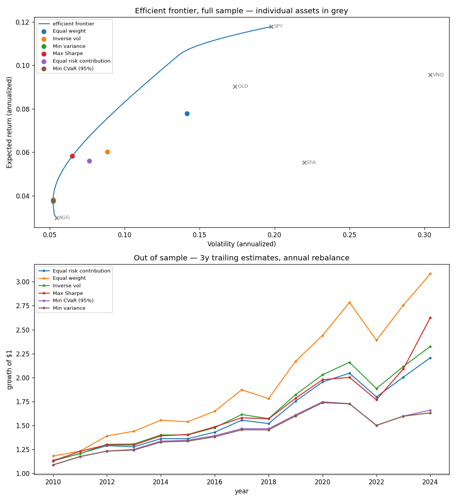

# Alpha to Allocation

**[Live site &rarr;](https://mihircoding.github.io/portfolioOptimization/)** —
the efficient frontier, the cointegration scan, the volatility surface and the
cross-sleeve allocation, charted from this repository's own output. The
interactive pricer runs in the browser.


Two strategies that produce a return stream, and the machinery that decides how
much of each to hold.

```
sleeves/statarb/     930 cointegrated equity pairs, long one leg and short the other
sleeves/volcarry/    sell a one-month ATM SPY call every month, delta-hedge it daily
src/                 the allocator: mean-variance, shrinkage, risk parity, CVaR,
                     a factor risk model, Black-Litterman, hierarchical risk parity
multi_strategy.py    the allocator, pointed at the two sleeves
```

They were three separate projects and the third one had a hole in it. Every
result in notes/allocator.md tests the optimizer on **assets** — five ETFs,
then fifty US large caps — and finds that equal weighting beats mean-variance
out of sample at every estimation window tried. Which is a real result, and it
has always had an obvious rejoinder: a risk allocator exists to combine
**strategies**, and when everything in the book is 85% correlated with the
market there is no risk left to diversify away.

`multi_strategy.py` removes the rejoinder. The two sleeves have a correlation of
**+0.03** and a diversification ratio of **1.39** against a theoretical ceiling
of 1.41 — about as clean a two-strategy book as exists. And for the first time
in this repository the optimizer wins, by more than a full unit of Sharpe.

It does not win for the reason the textbook predicts. It wins because one of
the two sleeves **does not make money**, mean-variance can see that and risk
parity, inverse volatility, HRP and min variance cannot — they never read an
expected return, by design, and the sleeve that earns nothing is also the
*quieter* one, so all four allocate 37–43% of the book toward it. A strategy
with no edge has no edge to be volatile about, which makes "calm" a terrible
proxy for "safe."

[RESULTS.md](RESULTS.md) has the tables, the t-statistic that says in advance
which of those two regimes you are in, and the check that matters: the overlap
window contains no 2008 and no March 2020, which inflates the volatility sleeve's
Sharpe by 0.57 — all of it in the risk, almost none in the return the optimizer
actually acted on.

243 tests.

```bash
pip install -r requirements.txt
python -m pytest -q                 # 243 passed

# all three together
python multi_strategy.py            # allocate across the sleeves, the headline result

# the allocator
python run_optimization.py          # frontier, walk-forward, Black-Litterman, costs
python factor_study.py              # 50 large caps, where a covariance has 1,275 parameters
python hrp_study.py                 # hierarchical risk parity
python hrp_split_study.py           # and the flaw in its published algorithm

# the stat-arb sleeve
python sleeves/statarb/scan.py            # screen 4,950 pairs, trade the survivors
python sleeves/statarb/control.py         # trade the 4,020 the screen REJECTED, as a control
python sleeves/statarb/screen_validity.py # the screen's 5% test rejects 15% of the time
python sleeves/statarb/survivorship.py    # the bias priced instead of admitted
python sleeves/statarb/walkforward.py     # refit the formation window, trade out of sample

# the volatility sleeve
python sleeves/volcarry/hedging_study.py  # sell and hedge an ATM call monthly since 2007
python sleeves/volcarry/ssvi_study.py     # one arbitrage-free surface, not six smiles
python sleeves/volcarry/arbitrage_study.py # butterfly and calendar checks on real quotes

# the interactive pricer
python -m streamlit run streamlit_app.py
```



## Results

| | |
|---|---|
| [RESULTS.md](RESULTS.md) | allocating across the sleeves, and the blind spot in risk parity |
| [notes/allocator.md](notes/allocator.md) | mean-variance, shrinkage, risk parity, CVaR, factor model, HRP — all out of sample |
| [notes/statarb.md](notes/statarb.md) | the cointegration screen, its control group, its size distortion, its survivorship bias |
| [notes/volcarry.md](notes/volcarry.md) | Black-Scholes from scratch, the SSVI surface, and what the hedge actually earns |
| [notes/interview-allocator.md](notes/interview-allocator.md) | how to talk about the allocator |

| [notes/interview-volcarry.md](notes/interview-volcarry.md) | how to talk about the options side |

The short version of all of it: the cointegration screen predicts almost
nothing out of sample and the sections after that measure why; the variance risk
premium is real and is the only thing here that reliably makes money; and the
optimizer loses to equal weighting on assets and beats it on strategies, for a
reason that reduces to a single t-statistic.

---

## How the three parts work

### The allocator

Given `n` assets with expected returns `μ` and covariance `Σ`, a portfolio with
weights `w` summing to 1 has expected return `wᵀμ` and variance `wᵀΣw`. Markowitz
picks the `w` that minimises variance for a given return; sweeping the return
target traces the **efficient frontier**.

The problem is that `μ` and `Σ` have to be estimated, and the optimizer treats
estimates as facts. With fifty assets a covariance matrix has 1,275 free
parameters and maybe a year of daily data to fit them with, so the optimizer
reliably finds the portfolio whose risk was *underestimated* by the sample — it
is an error-maximiser as much as a risk-minimiser. In notes/allocator.md the
sample covariance promises 9.2% risk and delivers 15.5%. Section 9 of that file
is what does and does not fix it, and the answer turns out to be a constraint
rather than a better estimator.

### The stat-arb sleeve

Two stocks are **cointegrated** if some linear combination of their prices is
stationary — the spread wanders but keeps coming back, so a wide spread is a
bet with a known direction. The Engle-Granger test regresses one on the other
and runs an ADF test on the residual.

Run it across every pair in the S&P 100 and 930 of 4,950 pairs pass at 5%. One
survives a Bonferroni correction. The mean out-of-sample Sharpe across the 930
is indistinguishable from zero, and the three sections after that one establish
why: a control group of the *rejected* pairs trades about as well, the screen's
nominal 5% test actually rejects 15% of the time, and the universe is today's
index members, so the left tail of the return distribution is missing entirely.

### The volatility sleeve

Black-Scholes prices an option as the cost of replicating it by continuously
trading the underlying. Nobody hedges continuously, so the interesting question
is what the discrete hedge misses — and the answer is that it is not noise, it
is a bet on variance:

```
P&L  =  ∫ ½ Γ S² (σ²_implied − σ²_realized) dt
```

Sell a one-month ATM SPY call every month from 2007 and delta-hedge it daily and
implied volatility averages 20.0% against 16.2% realized. The seller earns 0.405
per $100 a month at a Sharpe of 2.20, and loses 2.675 in March 2020. The gamma
decomposition reproduces the realized P&L with r = 0.99, which is what makes
"a delta-hedged option is a bet on variance" a measurement rather than a slogan.

That P&L series is what `multi_strategy.py` allocates, and the March 2020 number
is the one section 4 of RESULTS.md is about.
